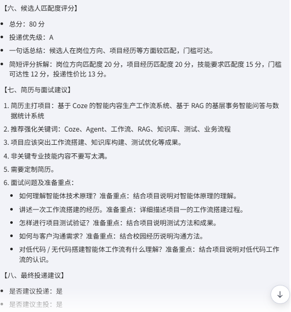
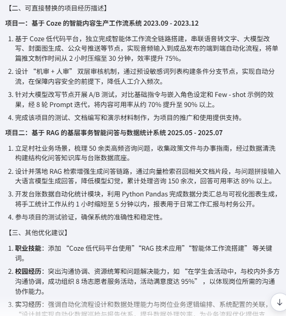
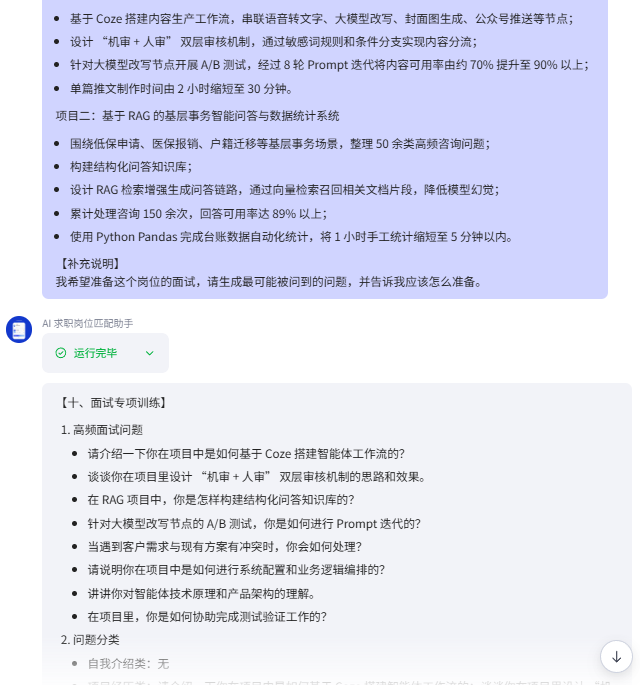

# AI 求职岗位匹配助手

## 项目演示

- Coze 智能体体验链接：https://www.coze.cn/store/agent/7640445182613225482?bot_id=true
- 项目演示视频：https://pan.quark.cn/s/457dcb7e0aa1
- 测试说明：本项目已完成岗位 JD 分析、人岗匹配、简历优化、面试题生成三个核心场景测试

> 说明：演示视频展示了从输入岗位 JD，到输出岗位匹配结果、简历优化建议和面试题生成的完整流程。

## 一、项目简介

AI 求职岗位匹配助手是一个面向 AI 应用方向求职者的岗位分析与求职辅助智能体。

本项目基于 Coze 搭建，围绕“岗位 JD 分析、人岗匹配、简历优化、面试准备”四个核心场景，帮助求职者快速判断一个岗位是否适合自己，并生成对应的投递建议、简历优化建议和面试准备方向。

项目目标不是做一个泛泛聊天机器人，而是构建一个具备岗位判断逻辑、候选人画像、项目经历映射和求职决策能力的 AI 求职辅助 Agent。

---

## 二、项目背景

AI 应用方向岗位名称复杂，很多岗位会出现以下问题：

- 岗位名称写 AI，但实际可能是销售、运营或客服；
- JD 中同时出现 Agent、工作流、AI 产品、开发、实施等关键词，求职者难以判断真实岗位类型；
- 求职者不知道自己的项目经历应该如何对齐岗位要求；
- 简历内容容易写得太泛，无法突出与岗位相关的能力；
- 面试准备容易变成通用问题，缺少针对具体 JD 的训练。

因此，本项目尝试构建一个 AI 求职岗位匹配助手，用于帮助求职者完成从岗位判断到投递准备的完整流程。

---

## 三、目标用户

本项目主要面向：

- AI 应用方向求职者；
- 应届生或初级求职者；
- 想投递 AI 应用实施、Agent 应用、Coze / Dify 智能体、AI 产品助理、AIGC 运营等岗位的人；
- 有项目经历但不知道如何写进简历的人；
- 想根据岗位 JD 准备面试的人。

---

## 四、核心功能

### 1. 岗位 JD 分析

用户输入岗位 JD 后，智能体会分析：

- 岗位基础信息；
- 岗位真实类型；
- 是否属于 AI 应用落地方向；
- 核心职责；
- 能力要求；
- 岗位门槛；
- 潜在风险。

---

### 2. 人岗匹配评分

智能体会结合固定候选人画像和项目经历，对岗位进行匹配度判断。

评分维度包括：

- 岗位方向匹配度；
- 项目经历匹配度；
- 技能要求匹配度；
- 门槛可达性；
- 投递性价比。

最终输出：

- 匹配度分数；
- 投递优先级；
- 是否建议投递；
- 是否建议主投；
- 主要匹配点；
- 主要风险点。

---

### 3. 简历定制优化

当用户同时提供岗位 JD 和原始简历时，智能体会输出：

- 当前简历最大问题；
- 与目标岗位最相关的简历内容；
- 应强化的关键词；
- 项目经历改写建议；
- 可直接替换进简历的项目描述；
- 不应该夸大的内容；
- 面试官可能追问的问题。

该模块强调真实性边界，不允许虚构经历、虚构数据或将候选人包装成不符合实际能力的高级开发工程师。

---

### 4. 面试题生成

当用户要求准备面试时，智能体会根据岗位 JD 和候选人项目经历生成：

- 高频面试问题；
- 问题类型；
- 为什么会问；
- 回答方向；
- 回答风险；
- 优先准备顺序。

问题覆盖：

- 自我介绍；
- 项目经历；
- Coze / Agent / 工作流；
- RAG / 知识库；
- Prompt / 测试优化；
- 业务理解 / 实施交付；
- 候选人短板。

---

## 五、系统设计思路

本项目围绕“AI 应用落地型新人”的求职定位进行设计。

整体流程如下：

```text
用户输入岗位 JD
        ↓
岗位真实类型判断
        ↓
岗位职责与能力拆解
        ↓
结合候选人画像与项目经历
        ↓
生成人岗匹配评分
        ↓
输出投递建议
        ↓
如提供简历，则生成简历优化建议
        ↓
如准备面试，则生成面试题与回答方向
```

---

## 六、知识库设计

项目知识库主要包括以下核心内容：

* **候选人画像知识库**
* **项目0：** RAG 校规问答系统知识库
* **项目1：** NovaTech 企业知识库客服智能体知识库
* **项目与岗位关键词对齐表**

> 💡 **知识库的核心作用：** 让智能体在分析岗位 JD（职位描述）时，不再进行泛泛的表面评价，而是能够深度结合候选人的**真实项目经历**进行精准判断与对齐。

---

## 七、Prompt 设计重点

本项目的 Prompt 设计主要围绕以下四个核心维度展开：

### 1. 岗位真实类型判断
智能体需要精准识别岗位到底属于以下哪种真实类型，剥离技术黑话：
* AI 应用实施
* Agent 应用项目助理
* AI 提效
* AI 产品助理
* AIGC 运营
* AI 应用开发
* 算法 / 大模型训练
* 伪 AI 包装岗位

### 2. 匹配度评分机制
系统设置了 **100分** 的量化评分规则：

| 评估维度 | 分值 |
| :--- | :--- |
| **岗位方向匹配度** | 25 分 |
| **项目经历匹配度** | 25 分 |
| **技能要求匹配度** | 20 分 |
| **门槛可达性** | 15 分 |
| **投递性价比** | 15 分 |

### 3. 风险识别
智能体需要化身“避坑助手”，敏锐识别以下潜在风险：
* 岗位是否偏**强开发**（技术栈是否过深）
* 是否存在销售、电销、催收等**伪 AI 风险**
* 是否存在**隐含的开发要求**
* 是否需要高频的客户交付、出差或高强度沟通
* 候选人是否存在致命的**技术短板**

### 4. 真实性边界
> ⚠️ **红线原则：** 在进行简历优化时，智能体必须严格遵守以下边界，确保求职诚信：
> * **不虚构**任何经历
> * **不新增**原始简历中没有的数据
> * **不夸大**成企业级上线项目
> * **不包装**成算法工程师或成熟开发工程师
> * **仅**基于候选人真实项目进行表达与润色优化

---

## 八、测试案例

### 场景 1：Agent 应用项目经理岗位匹配分析
* **测试输入：** * Agent 应用项目经理岗位 JD
    * 候选人固定画像
    * 项目0：RAG 问答项目
    * 项目1：Coze 智能体项目
* **测试结果：**
    * **岗位类型：** Agent 应用项目助理 / 项目经理助理
    * **是否属于 AI 应用落地方向：** 是
    * **匹配度：** 较匹配
    * **投递优先级：** A / S
    * **是否建议投递：** 是
    * **是否建议主投：** 是
    * **测试截图：**
    


### 场景 2：岗位 JD + 原始简历优化
* **测试输入：** * Agent 应用项目经理岗位 JD
    * 原始简历文本
* **输出结果：**
    * 简历适配性判断
    * 项目经历改写建议
    * 简历关键词优化
    * 不应夸大的内容提示
    * **可直接替换进简历的项目描述文本**
    * **测试截图：**
    

### 场景 3：面试题生成
* **测试输入：** * Agent 应用项目经理岗位 JD
    * Coze 工作流项目经历
    * RAG 知识库问答项目经历
* **输出结果覆盖维度：**
    * Coze 工作流搭建 & 系统配置与业务逻辑编排
    * RAG 知识库构建 & Prompt A/B 测试
    * 客户需求冲突处理
    * 智能体技术原理理解 & 测试验证方法
    * **技术短板回答策略**
    * **测试截图：**
    

---

## 九、项目亮点

* **拒绝流于表面：** 不只是普通的 JD 摘要总结，而是能够穿透表象判断岗位的**真实类型**。
* **精准人岗匹配：** 深度结合候选人画像和项目经历，进行量化的对齐分析。
* **定制化简历优化：** 支持“岗位 JD + 原始简历”的双向绑定改写。
* **全面风险穿透：** 能有效识别伪 AI 岗位、强开发岗位陷阱，并指出候选人短板。
* **全栈面试通关：** 能根据岗位 JD 针对性生成面试问题和结构化回答方向。
* **严守合规红线：** Prompt 中加入硬性“真实性边界”，彻底避免虚构简历造成的面试翻车。
* **生态定位精准：** 极度适合 AI 应用实施、Agent 应用、Coze / Dify 智能体、AI 产品助理等新兴岗位方向。

---

## 十、可证明能力

通过本项目，可以强有力地证明候选人具备以下显性能力：

* **技术工具力：** Coze 智能体搭建能力、Prompt 结构化设计能力。
* **业务拆解力：** AI Agent 应用场景拆解能力、业务流程理解能力。
* **人岗分析力：** 岗位 JD 深度分析能力、简历优化与项目包装能力。
* **工程思维：** 测试评估意识、AI 应用落地思维。

---

## 十一、当前局限

> 🔍 **客观认知：** 当前版本仍然是一个学习型和演示型项目，存在以下不足：
> * **输入限制：** 目前主要基于纯文本输入，尚未实现自动解析 PDF/Word 简历。
> * **效果波动：** 输出质量在一定程度上仍依赖大模型底座的 Prompt 遵循度。
> * **面试模块未完结：** 面试题模块目前仅提供回答方向，暂未生成完整的口语化逐字稿。
> * **人工依赖：** 岗位判断仍需要人工复核，无法完全替代资深 HR 或职业顾问。
> * **生态闭环：** 暂未接入外部招聘平台的官方 API。

---

## 十二、后续优化方向

为了推动项目的实用性与产品化落地，后续将围绕以下方向进行迭代：

* [ ] **多格式支持：** 支持上传 PDF / Word 简历并实现自动智能化解析。
* [ ] **批量化处理：** 增加岗位批量评分与一键对比功能。
* [ ] **求职看板：** 增加投递记录表与进度追踪漏斗。
* [ ] **多版本控制：** 增加针对不同岗位方向的简历版本一键生成。
* [ ] **交互式面试：** 引入语音或文本的动态面试模拟问答模式。
* [ ] **爬虫/插件集成：** 增加 Boss 直聘等主流招聘平台岗位的批量抓取与分析。
* [ ] **数据资产化：** 接入飞书表格或轻量级数据库，实现岗位分析结果的持久化保存。

---

## 十三、项目总结

**AI 求职岗位匹配助手**是一个完全围绕真实求职场景设计的 AI 应用落地项目。

它逆向打通了**岗位分析、人岗匹配、简历优化、面试准备**四个求职核心环节，旨在帮助 AI 应用方向的求职者在洪流般的岗位信息中，更高效地筛选出适合自己的机会，并生成精准切合 JD 的求职弹药。

该项目不仅全方位体现了 **Coze 智能体的搭建与流程编排能力**，更是对 **AI 应用落地、业务流程拆解、高级 Prompt 设计以及场景产品化**的一次深度实践。
